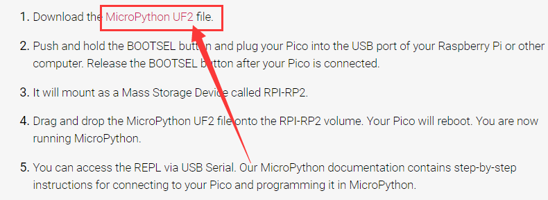

# 问题解答

## pico win7系统第一次上传代码后不能识别端口解决办法

按照这个步骤，第一次上传后没有出现端口

第一步：将pico开发板连接到电脑电脑

第二步：打开我们提供的软件

第三步：USB ID 红色框内为2E8A

Driver红色框内为 USB Serial(CDC) 后面的箭头可以选择

第四步:点击下载，等待下载完毕就成功了，这一步最好关闭杀毒软件

如果第一次没成功那就拔掉pico板重新在插上，在重新安装一遍

## pico固件下载路径

[https://www.raspberrypi.com/documentation/microcontrollers/micropython.html](https://www.raspberrypi.com/documentation/microcontrollers/micropython.html)

