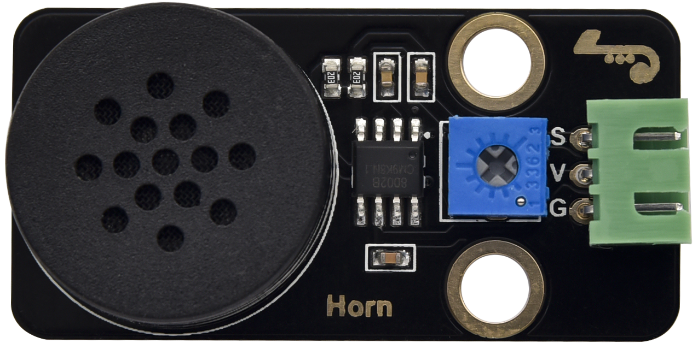
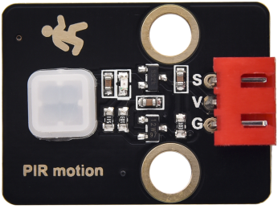
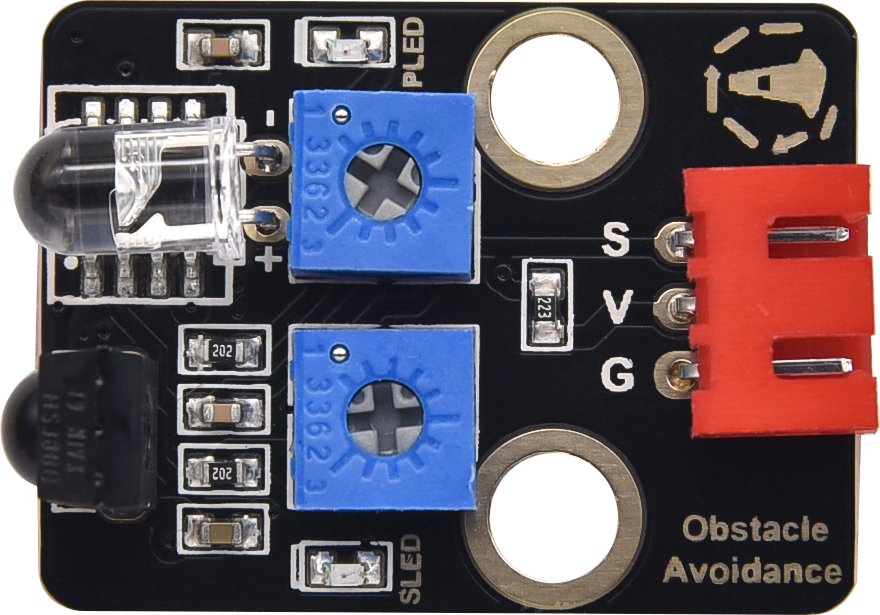
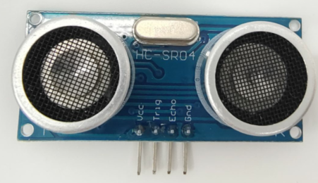
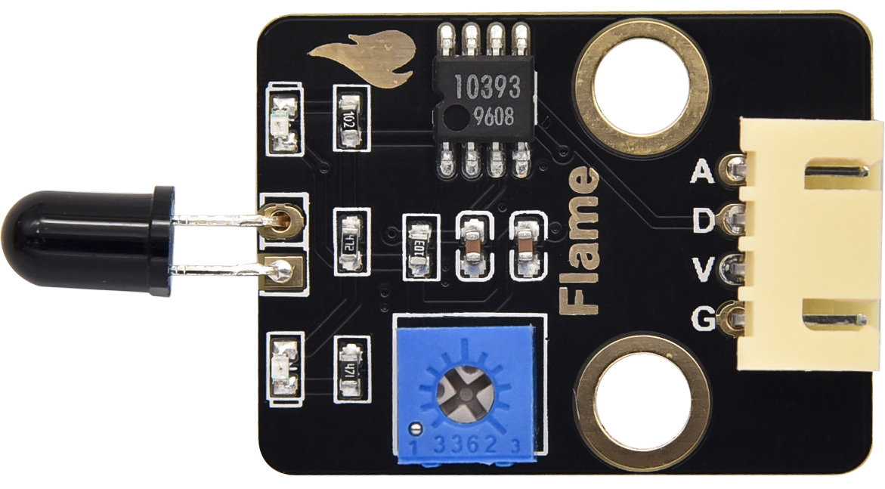
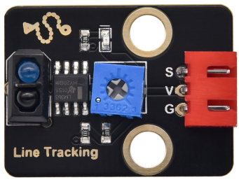
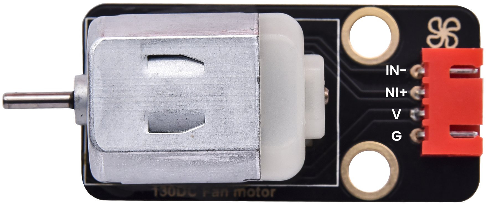
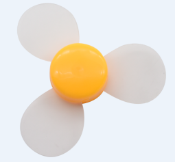
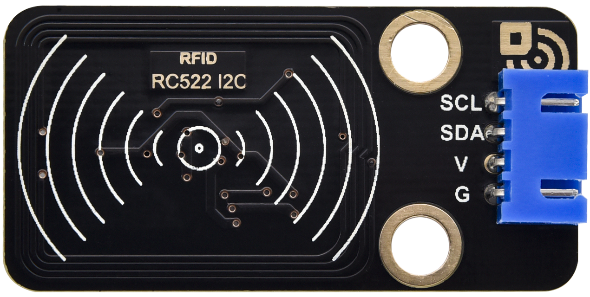

Keyes Raspberry Pi Pico 42合1 传感器套装

# 产品说明

首先，本pico传感器教程是基于树莓派上操作的，树莓派是一台卡片电脑，它的官方系统是Raspberry Pi OS，也可以给树莓派安装其它系统，例如：ubuntu，Windows IoT。可以使用树莓派来做一个个人服务器，路由器，接上摄像头就可以做摄像头监控，摄像头识别，接上麦克风方阵和喇叭就可以做语音交互助手等。本传感器套装主要包含了我们常用的42款传感器/模块，还有对应的Raspberry Pi Pico板、Raspberry Pi Pico扩展板和杜邦线。42款传感器/模块和我们提供的Raspberry Pi Pico扩展板接口完全匹配。使用时，我们只需要将Raspberry Pi Pico板堆叠在Raspberry Pi Pico扩展板，利用自带的杜邦线将传感器/模块连接在扩展板上，简单方便。

为了让你对这个42款传感器/模块有更深入的了解，我们还基于这个42款传感器/模块做个多个学习课程。这些课程是用树莓派官方推荐的在树莓派系统上的MicroPython IDE软件平台Thonny制作的，课程中我们提供了对应的原理图、接线方法、MicroPython语言代码、实验结果和简单的代码介绍还有基本的linux操作指令等信息。通过这些课程，可以让我们对编程方法、逻辑、电子电路以及linux有了更深刻的理解。

# 产品清单

|序号|图片|规格|数量|
|-|-|-|-|
|1||keyes 2021新款 DIY电子积木 白色LED模块 黑色环保(红色端子)|1|
|2||keyes 2021新款 DIY电子积木 共阴RGB模块 黑色环保（红色端子）|1|
|3||keyes 2021新款 DIY电子积木 交通灯模块 黑色环保（红色端子）|1|
|4||keyes 2021新款 DIY电子积木 有源蜂鸣器模块 黑色环保（红色端子）|1|
|5||keyes 2021新款 DIY电子积木 8002b功放 喇叭模块黑色环保(绿色端子)|1|
|6||keyes 2021新款 DIY电子积木 单路按键模块 黑色环保（红色端子）|1|
|7||按键帽 A24 黄帽(12*12*7.3)圆|1|
|8||keyes 2021新款 DIY电子积木 倾斜传感器 黑色环保（红色端子）|1|
|9||keyes 2021新款 DIY电子积木 人体红外热释传感器黑色环保（红色端子）|1|
|10||keyes 2021新款 DIY电子积木 避障传感器 黑色环保（红色端子）|1|
|11||keyes 2021新款 DIY电子积木 6812 RGB模块 黑色环保（红色端子）|1|
|12||keyes 2021新款 DIY电子积木 NTC-MF52AT模拟温度传感器黑色环保（绿色端子）|1|
|13||keyes 2021新款 DIY电子积木 光敏电阻传感器 黑色环保（绿色）|1|
|14||keyes 2021新款 DIY电子积木 声音传感器 黑色环保（绿色端子）|1|
|15||keyes 2021新款 DIY电子积木 旋转电位器传感器黑色环保（绿色端子）|1|
|16||keyes 2021新款 DIY电子积木 红外接收模块 黑色环保（蓝色端子）|1|
|17||keyes 2021新款 DIY电子积木 干簧管模块 黑色环保（红色端子）|1|
|18||keyes 2021新款 DIY电子积木 旋转编码器模块 黑色环保（蓝色端子）|1|
|19||keyes 2021新款 DIY电子积木 摇杆模块 黑色环保|1|
|20||摇杆帽3D PS2 蘑菇头环保|1|
|21||keyes 2021新款 DIY电子积木 HT16K33_8X8点阵模块黑色环保（蓝色端子）|1|
|22||keyes 2021新款 DIY电子积木 TM1650四位数码管模块黑色环保（蓝色端子）|1|
|23||keyes 2021新款 DIY电子积木 薄膜压力传感器 黑色环保（绿色端子）|1|
|24||keyes 2021新款 DIY电子积木 DS1307时钟传感器模块黑色环保（蓝色端子）|1|
|25||HC-SR04P超声波测距模块 测距传感器模块 3-5.5V宽电压（2020新款）|1|
|26||9G 23*12.2*29mm 蓝色 90度 3V/5V兼容舵机内部电源滤波电容47UF环保（掉电不自锁）|1|
|27||keyes 2021新款 DIY电子积木 电容触摸模块 黑色环保（红色）|1|
|28||keyes 2021新款 DIY电子积木 光折断模块 黑色环保（红色端子）|1|
|29||keyes 2021新款 DIY电子积木 霍尔传感器 黑色环保|1|
|30||keyes 2021新款 DIY电子积木 火焰传感器 黑色环保（黄色端子）|1|
|31||keyes 2021新款 DIY电子积木 单路循线传感器 黑色环保（红色端子）|1|
|32||keyes 2021新款 DIY电子积木 模拟气体传感器 黑色环保（黄色端子）|1|
|33||keyes 2021新款 DIY电子积木 XHT11温湿度传感器（兼容DHT11）黑色环保（蓝色端子）|1|
|34||keyes 2021新款 DIY电子积木 18B20温度传感器 黑色环保（蓝色端子）|1|
|35||keyes 2021新款 DIY电子积木 130电机模块 黑色环保（红色端子）|1|
|36||三叶软桨|1|
|37||keyes 2021新款 DIY电子积木 激光模块 黑色环保（红色端子）|1|
|38||keyes 2021新款 DIY电子积木 水滴传感器 黑色环保（绿色端子）|1|
|39||keyes 2021新款 DIY电子积木 太阳光紫外线传感器黑色环保（绿色端子）|1|
|40||keyes 2021新款 DIY电子积木 RFID刷卡模块 黑色环保（蓝色端子）|1|
|41||keyes 2021新款 DIY电子积木 碰撞传感器 黑色环保（红色端子）|1|
|42||keyes 2021新款 DIY电子积木 酒精传感器 黑色环保（黄色端子）|1|
|43||keyes 2021新款 DIY电子积木 LCD_128X32_DOT模块黑色环保（蓝色端子）|1|
|44||keyes 2021新款 DIY电子积木 五路AD按键模块 黑色环保（绿色端子）|1|
|45||keyes 2021新款 DIY电子积木 ADXL345加速度传感器模块黑色环保（蓝色端子）|1|
|46||树莓派 Raspberry Pi Pico 焊下排针 KE3036带主板 KE3037不带主板|1|
|47||1*3直针 黄色 2.54 环保|1|
|48||keyes raspberry pico IO 扩展板 黑色环保|1|
|49||JMP-1 17键86*40*6.5MM 黑色 环保|1|
|50||AM/MK5P(micro)黑色 OD：3.5 L=1M PVC过粉|1|
|51||母对母20CM/40P/2.54/10股铜包铝 24号线BL 环保|0.1|
|52||XH2.54-3Pin+杜邦母单 长19.5cm (红线在中间)|13|
|53||HX-2.54 4P 转杜邦线母单 26AWG 黑红白棕 200mm|6|
|54||HX-2.54 5P 转杜邦母单 22AWG 黑红棕白黄 200mm|3|
|55||白卡 85.5*54*0.80MM 环保|1|
|56||TAG-03 41*33*403mm ABS蓝色|1|

当收到这个Pico传感器套件的时候，首先看到是一个包装精美的外盒，每个配件被安全且有序的装在外盒里面的小袋子里，先来清点一下：

